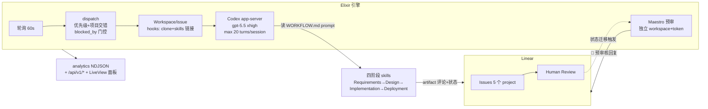
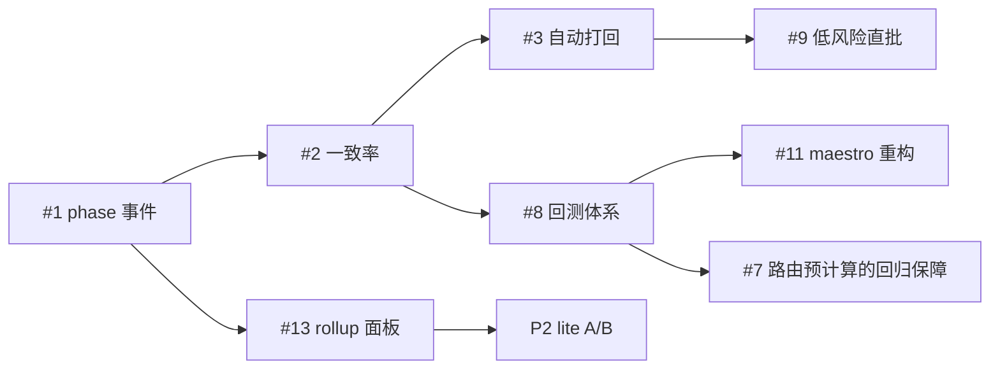

# Symphony 软件工厂现状评审与改进方案

日期：2026-07-04
范围：`bin/symphony-run grandline` 全链路 — Elixir 引擎、`workflows/agavemindlab` WORKFLOW + skills（含 -lite 变体）、Maestro 预审、analytics 数据、SPEC 对照。
数据窗口：`elixir/log/symphony-analytics.ndjson` 2026-06-25 ~ 2026-07-04（11,919 条事件，30 个 issue，198 次 run）。

---

## 0. 核心结论（TL;DR）

系统整体成熟度高于预期：16 条目标中 9 条已基本落地，架构分层清晰（引擎只做调度/工作区/会话，业务全在 prompt+skills，Maestro 独立身份预审）。但存在四个结构性问题，它们共同构成当前的主要风险与成本来源：

1. **遥测断层（目标 13 的地基缺失）**：`phase_event` 在 analytics.ex 中有统计口径但**全代码库无发射器**，Autonomy Funnel / Quality / Rework 面板永远是 gap。没有 phase 级数据，就无法测量 rework 率、自动推进率、lite vs base 的效果——**目标 16 的回测评估也因此无从谈起**。
2. **规则堆积对抗自身的简化原则**：git 历史中 30+ 条 `fix(maestro)` 提交，maestro-reviewer.md 已 400+ 行且每次线上误判就长一条新规则（DEV-5084 分支又 +39 行）；WORKFLOW Main Flow 步骤 4–5 的意图识别逻辑同样在持续增生。这正是 AGENTS.md 明确反对的"补丁越打越长"模式，根因是**没有回测手段，只能靠加规则防复发**。
3. **路由税**：每次 dispatch，LLM 都要从原始 Linear 评论重新推导"当前阶段/人类意图/目标阶段"。数据佐证：输入:输出 token ≈ 300:1，单 issue 最高 1.88 亿 tokens，10 天 12.7 亿 tokens。这既是成本问题，也是出错面——步骤 4–5 是全系统最复杂、最常打补丁的逻辑。
4. **Maestro 只建议不执行（目标 11 未实现）**：所有裁决仍需人工执行状态切换，"建议打回直接打回、低风险直批"完全没有落地，而这是把人从审核循环中进一步解放的关键一步。

**最高优先级动作（P0）**：打通 phase 级遥测 → 记录 Maestro 建议 vs 人类最终裁决 → 基于一致率数据给 Maestro 裁决执行权（先打回、后低风险批准）→ 用 artifact-eval 扩成回归评估集，让 prompt/规则修改从"加规则"转向"加 fixture + 回测"。这四件事互为因果，构成一个自我改进闭环。

---

## 1. 现状架构速览

分层职责（与 SPEC 一致）：

| 层 | 职责 | 关键事实 |
|---|---|---|
| 引擎 | 轮询、claim、并发（全局 5）、workspace、Codex 会话、重试/对账、Maestro 触发 | 阶段机制**不在引擎**；blocked/retry 状态重启即失；仅轮询无 webhook |
| WORKFLOW.md | Main Flow 路由、Phase Artifact 协议、rework 协议、spawning、guardrails | 434 行，每次 dispatch 全量执行 |
| phase skills | 各阶段做事标准 + 证据要求 + 第三方 skill 调用 | base 版 210–490 行/skill；lite 版 15–80 行 |
| Maestro | Human Review 时自动预审，发建议回复，不改状态 | `.codex/skills/maestro/`，引擎内 `maestro_pre_review.ex` 触发 |

---

## 2. 逐目标评估

评级：✅ 已达成 · 🟡 部分达成 · 🔴 缺失

### 目标 1 — 自动获取任务并推进 ✅

**现状**：引擎轮询（`polling.interval_ms: 60000`）+ `active_states`（Todo/In Progress/Merging/Rework）+ `symphony` label 过滤 + 优先级排序 + 多项目交错调度。SPEC 级 blocked_by 门控保证依赖顺序。
**差距**：轮询 60s 的响应延迟；`blocked`/retry 队列在内存中，引擎重启后丢失（重启后靠重新轮询恢复，行为正确但会重复已做过的路由判断）。
**建议**：维持轮询（简单可靠），P2 再考虑 Linear webhook。重启恢复可接受，不必优先投入。

### 目标 2 — 每阶段独立 session、避免上下文过长 🟡

**现状**：机制存在且设计正确——auto-advance 通过 `.symphony/stop-after-turn` 结束当前 run，下次 dispatch 以全新 Codex session 从 Linear artifacts + workpad 恢复状态。Requirements/Design 可自动推进，Implementation 强制停在 Human Review。
**差距**：
- **单阶段内部**没有上下文控制：一次 dispatch 最多 20 turns 在同一 session 内，Implementation 这类长阶段单 session 输入 token 可达 4.7M+（实测 DEV-5324 一次 run 7.6M total）。
- 每次新 session 要支付"路由税"：重新读全部未 resolve artifacts + 评论 + 推导意图，才开始干活。
**建议**：
1. Implementation 阶段内推行 **subagent 委派**（WORKFLOW 已授权 subagent，phase-implementation 已引用 `subagent-driven-development`，但未强制）：主 session 只保留计划与验收，代码编写下沉到子 agent，可将主 session 上下文压缩数倍。
2. 配合 §3.2 的路由预计算，把每次 session 冷启动的重放成本降下来。
3. 在 cost_snapshot 中补记 **cached vs uncached input tokens**（codex usage 事件里有，引擎未落盘），否则无法判断 300:1 的输入比中多少是真实成本。

### 目标 3 — 自动拆解 + blocking 关系 + 自动接续 🟡

**现状**：`symphony-issue` 有完整的 Tier A（follow-up/related/downstream 自主创建）/ Tier B（blocking/sub-issue 提案+人类同意）机制，幂等、去重、intake 状态、指派 creator。引擎级 blocked_by 门控使"前置完成后自动开始"成立。
**差距**：
- **拆出来的子 issue 默认不可调度**：安全不变量规定 spawned issue 落 intake 态、不带自动派工，人必须逐个补 `symphony` label + Todo。Maestro 新规则却要求"缺 label/状态时 request changes 补上"——**WORKFLOW 的安全不变量与 Maestro 的可调度性要求存在方向性矛盾**，需要显式裁决。
- 没有"父 issue 聚合"语义：所有子任务完成后父 issue 不会自动恢复推进（除非父被子 block 且父仍在 active 态——这个路径可用但未标准化）。
- 拆解本身是被动的（发现了才拆），没有"复杂度超阈值应当拆"的主动判断标准。
**建议**：
1. **裁决矛盾**：推荐方向——人类在 Tier B 提案下回复"同意"即视为同意其被调度，`symphony-issue` fulfill 时直接创建为 `symphony` label + Todo + 正确 blocking 关系（同意这一次点头已经是人类授权，再要求人工逐个补 label 是重复审批）。Tier A 自主创建的维持 intake 不自动调度。
2. 标准化 **Epic 模式**：父 issue 被全部子 issue block、置 Todo，子全部 Done 后引擎自然重新派发父 issue 做集成验收。在 phase-requirements 中加入拆解判据（如：预计 >1 个 PR / 跨 repo / 可并行）。

### 目标 4 — 跨 repo 全局观 🟡

**现状**：WORKFLOW 内嵌 canonical project routing registry（5 项目职责表 + 非目标项目黑名单）；`project-for-linear-project.sh` 按 Linear project slug 路由到各自 repo 配置；跨项目发现自动拆分多个 issue 并建依赖。
**差距**：注册表三处维护（WORKFLOW 表格、shell case 的硬编码 slug、各 project.env），新增项目要改共享 prompt；grandline-lite 的 case 又复制了一份。无跨 repo 联调/集成验收的标准流程。
**建议**：项目注册表收敛为单一数据文件（如 `workflows/grandline/projects.yaml`：slug→名称→职责→repo→base branch），shell 路由与 WORKFLOW 表格由它生成（或 WORKFLOW 用模板变量注入表格）。跨 repo 集成验收作为 Epic 模式（目标 3）的父 issue 职责。

### 目标 5 — 测试与端到端验收 ✅（纸面强，验证链有单点）

**现状**：这是设计最扎实的部分。三类可验证性（当场可验/延迟验收/需人工判定）、双重验收（pre-PR 本地 + post-merge 生产）、证据形态强制（交互必须截屏/录屏、性能必须 before/after + 可重跑命令）、类型条件化 skill（qa/design-review/refactor/benchmark）、Deployment 阶段的 `⚠️ 待观察` 重入机制。DEV-5084 新增的 Maestro 规则进一步要求跨组件路径必须有黑盒运行时证据。
**差距**：
- 证据是 Linear 里的文本/截图，**唯一的校验者是另一个 LLM（Maestro）**——没有机器可验的证据契约（命令+退出码、CI artifact 链接的结构化引用）。
- 各 repo 的 e2e 基建（setup.sh 拉起环境）不统一，"能自动化验收"的上限由各 repo 决定。
**建议**：定义**验收证据包（evidence bundle）**轻量约定：Implementation artifact 的每条 S<N> 证据附「可重跑命令 + 预期断言」，Maestro 审核时可抽查执行（它有只读 workspace）。不追求全自动验证，先让抽查成为可能。

### 目标 6 — UI/UE 设计 sense 🔴（最弱项）

**现状**：phase-design 强制 mermaid/ASCII 图（多组件/异步/迁移/安全边界），要求交互类验收有视觉证据；`design-review`/`qa` skill 做实现后的设计审查。
**差距**：**没有任何"设计先行"的产出物流程**——不出设计稿、不出原型、人类无法在实现前体验方案。设计阶段的 UI 决策以文字描述通过审核。
**建议**：为 `Type:Feature` 且涉及 UI 的 issue，在 phase-design 增加**原型产出步骤**：生成静态 HTML/CSS 原型（gstack 已有 design-shotgun/design-html 类能力可参考），截图或整包上传为 Linear attachment，Design artifact 内嵌预览图；有条件的 repo 部署 preview URL。Design 审批的对象从"文字方案"升级为"可看/可点的原型"。这是纯 skill 层改动，不动引擎。

### 目标 7 — Linear 下清晰进展 ✅

**现状**：Phase Artifact 协议（固定标题路由、resolve+重发的不可变审计链、结论先行的中文 prose 规则、折叠证据、skills footer 含 session id）。近期提交（69b6a1a 等）还在持续打磨可读性。
**差距**：长 issue 评论区随轮次膨胀，人要找"现在到哪了"仍需扫描；resolved 历史虽折叠但状态总览缺失。
**建议**：每 issue 维护一条**置顶状态卡**（非 phase 评论，允许 `commentUpdate`）：当前阶段、等待谁、最新 artifact 链接、S<N> 完成度。约 10 行的 skill 改动，显著降低人类扫描成本。

### 目标 8 — 正确理解人类回复意图、打回路由、信息清晰 🟡（能用，但脆弱且昂贵）

**现状**：Main Flow 步骤 4–5 覆盖极全：提案同意通道与阶段审批通道分离、跨阶段反馈扫描、PR 人类评论纳入、bot 过滤、`[NEEDS CLARIFICATION]` 优先分支、两个例外（Merging 门控、待观察重入）、无反馈时按状态裁决、cross-phase rework 的 artifact 失效与反馈保全。
**差距**：
- 这段逻辑是**全系统最大的单点复杂度**，由 LLM 每次 dispatch 重新执行；git 历史显示它是打补丁最频繁的区域之一（"resolve closed phase artifacts"、"rollback artifact superseding"、"clarify active phase artifact handling"…）。
- 意图误读没有度量：读错一次 → 人工纠正 → 加一条规则，无回归保障。
- 「`In Progress` + 无反馈 = 批准」的隐式语义对误操作零容错（手滑改状态即视为批准）。
**建议**：
1. **引擎侧路由预计算（routing brief）**：引擎本就拉取 issue 与评论，可确定性计算出结构化事实清单——各 artifact 的 resolve/closing-reply 状态、每条新评论的 parent 归属与时间序、awaiting-review 阶段——注入 prompt 作为"已核实事实"。LLM 只做真正需要判断的意图理解（approve/question/change request），不再重推机械事实。预期同时降低 token 成本与误读率，并让 Main Flow 步骤 4 大幅缩短（符合"以删代加"）。
2. **人类快捷指令**作为快路径：约定 `/approve`、`/rework design`、`/rework requirements` 等显式回复，精确匹配则跳过意图推断；自然语言仍走原逻辑。零风险增量，向人类审核者宣贯即可。
3. 意图路由决策进入遥测（见目标 13），误读率成为可测指标，进而进入回测集（目标 16）。

### 目标 9 — 主动澄清 ✅

**现状**：批量澄清协议（immaterial 记假设不问 / material 批量问 / 高影响 🔴 强制逐条回答）、`同意默认` 约定、两轮升级 @creator、blocked 硬停路径、澄清答案折叠进新版 artifact。设计成熟，无重大差距。
**建议**：仅一点——澄清问答对是天然的评估数据（哪些问题人类改了默认选项），纳入目标 16 的语料采集。

### 目标 10 — Maestro 严苛审核 ✅（有效，但正在规则化膨胀）

**现状**：Human Review 状态迁移自动触发；独立 workspace + 独立 Linear 身份；证据优先（要求新鲜 PR/CI/运行时证据，不信自报）；6 种建议动作 + 置信分 + 现成中文回复稿 + 依据条目；`🤖 Maestro 预审核:` 标记防重。DEV-5084 又强化了多 PR 归类、跨组件运行时证据、blocker 优先级继承、Spike 范围收窄拦截。
**差距**：
- **审核质量无度量**：Maestro 建议与人类最终裁决的一致率没有记录，无从知道它的误杀率/漏放率，也无法证明 30+ 次规则修补是在变好。
- **规则累积模式**：maestro-reviewer.md 每次误判 +1 条 case 规则，与 AGENTS.md 的简化原则相悖；长 prompt 本身也稀释每条规则的遵循度。
- 单视角审核：一个 agent 一把过，高风险阶段没有第二双眼睛。
- 运维脆弱点：`MAESTRO_LINEAR_API_KEY` 失效时**静默跳过**预审；失败 run 的 `-maestro` workspace 可能残留。
**建议**：
1. **先测量再修规则**（P0）：每次预审落一条结构化事件（issue、阶段、建议动作、置信分）；人类最终动作由引擎从状态历史对账回填 → agreement rate 面板。此后每条新规则都要回答"它修复的 case 在回测集里吗"。
2. **规则重构为 rubric + fixtures**：把 case 特异性规则（如"Spike 静默收窄"）转化为 artifact-eval fixture，prompt 里只留原则性 rubric。目标是 maestro-reviewer.md 变短而非变长。
3. 凭据失效改为**显式告警**：analytics 记 `maestro_skipped` 事件 + 面板红字（现在是 debug 日志级别的静默）。
4. P1 再考虑高风险 Implementation 的双视角审核（正确性 lens + 部署风险 lens 各一个子 agent，结论合并）。

### 目标 11 — Maestro 建议打回直接打回、低风险直批 🟡（勘误：打回已存在）

**现状**（2026-07-04 勘误）：预审 session prompt 的 rule 3 一直指示 request
changes 时直接置 `Rework`——"只建议不执行"仅对 approve 成立。缺的是审计标记、
关闭开关和低风险直批。前两者已随 MAESTRO_AUTO_REWORK 落地。
**建议**（本报告最高价值单项，分三步走）：
1. **第一步（低风险，先行）：自动执行"打回"**。request changes 建议 → Maestro 直接置 `Rework` 并把回复稿发出。打回完全可逆（人不同意可改回），且打回本来就是让 agent 返工、不需要人的判断增值。设 `MAESTRO_AUTO_REWORK=true` 开关灰度。
2. **第二步：低风险直批 Requirements/Design**。这两个阶段的批准也可逆（后续阶段还有多道门）。批准条件 = 建议 approve + 置信分 ≥ 阈值 + 无高影响 🔴 未决项 + 该 issue 无人类否决 Maestro 的历史。相当于把 agent 侧已有的 auto-advance 信心门升级为"独立第二 agent 复核后放行"，比现状（agent 自评 ⏩）更严而非更松。
3. **永久人工保留区**：`Merging`（不可逆合并）与 `Done`（关单）始终人工。Implementation approve 只发 merge nudge。
4. 配套：所有自动裁决打上 `🤖 auto` 标记 + 每日面板列出自动裁决清单供抽查；一致率（目标 10 建议 1）低于阈值自动降级回纯建议模式。**依赖：先有目标 10 的一致率数据，用数据决定阈值，而不是拍脑袋。**

### 目标 12 — 人类只需在 Linear 回复与审核 ✅（架构成立，剩余摩擦点明确）

**现状**：闭环成立——建 issue → 四阶段推进 → artifact 审核 → Merging → Deployment → 待观察重入 → 人工关单。
**剩余摩擦**：a) 子 issue 补 label/状态（目标 3 建议 1 消除）；b) Maestro 建议要人工执行（目标 11 消除）；c) `Merging` 状态切换（有意保留）；d) 打回无方向时的一问一答多一轮（可接受）。
**建议**：完成目标 3/11 的改进后，人类的常规操作收敛为：回答澄清、审 Design/实现、置 Merging、关单——达到目标预期。

### 目标 13 — 效率指标持久化 + API + 面板 🟡（骨架在，核心数据断供）

**现状**：NDJSON 持久化（append-only + 文件锁）+ `/api/v1/state|<issue>|refresh` + LiveView 6 面板 + 终端面板。已落数据：run_started/run_completed/retry_scheduled/cost_snapshot/capacity_snapshot。
**差距**（按严重度）：
1. **`phase_event` 零发射**（analytics.ex:245 有统计口径，全库无调用点）→ Autonomy Funnel、Quality/Rework 面板永远 gap。根因：阶段在 prompt 层，引擎看不见。
2. 面板读取仅 tail 500 条事件，11,919 条历史大部分不可见；无留存/汇总（SPEC 亦列为 TODO）。
3. cost_snapshot 无 cached/uncached 拆分，1.27B input tokens 的真实成本不可知。
4. rework 率、人工触碰次数、Maestro 一致率、意图误读率全部缺失。
**建议**：
1. **引擎从 Linear 衍生 phase 事件**（推荐，零 prompt 改动）：引擎已轮询 issue，扩展为拉取评论元数据，按 Phase Artifact 协议的固定标题 + 闭合回复（`✅`/`⏩`/`🔧`/`🔄`）确定性解析出 phase_started/published/approved/auto_advanced/reworked 事件。协议本身就是为路由设计的结构化格式，机器可解析是它的既有属性。备选：给 agent 注入 `symphony_metric` dynamic tool 由 skill 主动上报——可靠性依赖 agent 自觉，不如引擎解析。
2. 每日 rollup 任务：NDJSON → 按 issue/日聚合的 SQLite（或 rollup NDJSON），面板改读聚合层；原始文件按月归档（log 目录已有 archive- 惯例）。
3. 新增事件：`maestro_review`（建议+置信分）、`maestro_skipped`、`human_verdict`（对账回填）、`routing_decision`。
4. 面板补三条北极星曲线：**issue 端到端周期**（created→Done）、**rework 率**（95/198 的 run 发生在 Rework 态——现在连这个都只能靠手工 jq）、**每交付 issue 成本**。

### 目标 14 — 合适的 skills ✅

**现状**：superpowers（brainstorming/TDD/systematic-debugging/writing-plans/verification-before-completion）+ gstack（qa/design-review/benchmark/plan-eng-review/review）按类型条件化接入四阶段；`Skipped <skill>: <reason>` 记录 + artifact footer 审计。
**差距**：引用的第三方 skill 在各 workspace 的 Codex 环境里是否可用无周期性校验（漂移只会表现为 runtime 静默跳过）。
**建议**：给 after_create hook 加一步 skill 清单自检（引用的 skill 目录存在性），缺失记入 analytics；低成本高确定性。

### 目标 15 — codex + gpt-5.5 harness ✅

**现状**：`codex --config model="gpt-5.5" --config model_reasoning_effort=xhigh app-server`，approval never + workspace-write + turn 级 dangerFullAccess；Maestro 走同一 harness。
**建议**（成本优化，非功能）：引擎支持**按状态覆写 codex 配置**（并发已有 by_state 先例）：如 Rework/Requirements 用较低 reasoning effort。先等目标 13 的成本数据定位真实热点再动，避免过早优化。

### 目标 16 — 回测评估数据集 🔴（雏形在，闭环未成）

**现状**：`artifact-eval` skill 可 capture Linear artifact → 本地 replay 阶段 skill → 产出 report；`verify-fixtures` 校验 fixture 结构。引擎侧有 3700 行 core_test + 真实 Linear/Codex 的 e2e。
**差距**：
- capture 是手动的，没有从生产流量持续积累语料；
- replay 只产出草稿**不评分**——没有"人类最终裁决"作为 ground truth 的对比；
- 与 CI 无关联：改 WORKFLOW/skill/maestro 规则时不会自动跑回归；
- -lite 变体（7/1 刚建，明确是做对照实验的）没有任何测量手段支撑对比结论。
**建议**（依赖目标 13 的数据管道）：
1. **自动采集**：每次 Human Review 交接 + 每次 Maestro 预审 + 每次人类裁决，自动 capture 为 eval case（复用 artifact-eval 的格式），按阶段/类型归档。目标：两周内积累 50+ 带 ground truth 的 case。
2. **两个最有价值的评估任务**先行：a) **Maestro 裁决评估**——replay maestro-reviewer 于历史 case，比对建议动作 vs 人类最终动作（一致率/误杀/漏放）；b) **意图路由评估**——replay Main Flow 步骤 4–5 的目标阶段判定 vs 实际执行。这两处正是规则打补丁最频繁的地方。
3. **接入变更流程**：`.github/workflows` 加一个 job——WORKFLOW.md / skills / maestro-reviewer.md 的 PR 触发 eval replay，报告一致率变化。此后"每次误判加一条规则"改为"每次误判加一条 fixture，修复需通过全量回测"。
4. lite vs base 对照：按 Linear project 分流（部分项目跑 -lite profile），用目标 13 的周期/成本/rework 指标对比，4 周出结论。

---

## 3. 横切问题与根因

### 3.1 规则堆积 vs 简化原则（影响目标 8、10）

git 历史模式清晰：线上误判 → `fix(maestro)`/`fix(workflow)` 加一段规则 → prompt 变长 → 遵循度稀释 → 新误判。maestro-reviewer.md 与 Main Flow 步骤 4–5 是两大重灾区。**根因不是规则写得不好，而是缺少回测手段，加规则是唯一可用的防复发工具。** 解法即目标 16：把 case 沉淀为 fixture，修复以"回测通过"为准，prompt 反而应该随重构变短。

### 3.2 路由税（影响目标 2、8、成本）

每次 dispatch 由 LLM 重推机械事实（artifact 状态、评论归属、时间序）。10 天 1.27B input tokens、输入输出比 300:1。解法：引擎路由预计算（目标 8 建议 1）——机械事实引擎算，LLM 只判意图。同时是准确性修复和成本修复。

### 3.3 遥测断层（影响目标 13、16、11）

phase_event 无发射器是单点根因：它断掉了 rework 率 → Maestro 一致率 → 自动裁决阈值 → 回测 ground truth 整条数据链。**P0 中优先级最高的一项。**

### 3.4 静默失败点

- Maestro key 失效 → 静默跳过预审（人以为有预审兜底）；
- hook 失败多为 logged-ignored；
- 第三方 skill 缺失 → runtime 静默 Skipped。
统一解法：失败进 analytics 事件 + 面板显式红字，不新增告警基础设施。

### 3.5 安全不变量 vs 自动化诉求的矛盾（影响目标 3、12）

"spawned issue 永不自动派工" vs Maestro "要求补 label/状态使其可调度"。两条规则各自合理但方向相反，需要一次显式裁决（建议见目标 3）。

---

## 4. 改进路线图

### P0 — 数据与闭环地基（1–2 周，互相成就，建议一个批次做完）

| # | 事项 | 层 | 规模 | 对应目标 |
|---|------|----|------|---------|
| 1 | 引擎解析 Linear 评论 → 发射 phase_started/approved/auto_advanced/reworked 事件 | 引擎 | M | 13,16 |
| 2 | 记录 `maestro_review` 事件 + 引擎对账回填 `human_verdict` → 一致率面板 | 引擎 | S | 10,11,16 |
| 3 | Maestro 自动执行"打回"（`MAESTRO_AUTO_REWORK` 开关灰度） | 引擎+maestro skill | S | 11,12 |
| 4 | 静默失败显式化：maestro_skipped / hook 失败 / skill 缺失进 analytics+面板 | 引擎 | S | 10,14 |
| 5 | cost_snapshot 补 cached/uncached token 拆分 | 引擎 | S | 13,15 |
| 6 | 人类快捷指令 `/approve` `/rework <phase>` 快路径 | WORKFLOW | S | 8,12 |

### P1 — 结构性改进（2–6 周）

| # | 事项 | 层 | 规模 | 对应目标 |
|---|------|----|------|---------|
| 7 | 引擎路由预计算：routing brief 注入 prompt，Main Flow 步骤 4 相应缩短 | 引擎+WORKFLOW | L | 8,2,成本 |
| 8 | 回测体系 v1：自动采集 eval case + Maestro/路由两个评估任务 + PR 触发回归 | skill+CI | L | 16 |
| 9 | Maestro 低风险直批 Requirements/Design（用 #2 的一致率数据定阈值） | 引擎+maestro | M | 11 |
| 10 | 拆解自动化：consent 后子 issue 直接可调度 + Epic 父聚合模式；裁决 §3.5 矛盾 | WORKFLOW+skill | M | 3,12 |
| 11 | maestro-reviewer.md 重构：case 规则转 fixture，prompt 收敛为 rubric（依赖 #8） | maestro | M | 10 |
| 12 | UI 原型产出流程：Design 阶段出 HTML 原型/截图供人体验 | skill | M | 6 |
| 13 | 指标 rollup + 历史面板（周期/rework/成本三条北极星曲线） | 引擎 | M | 13 |
| 14 | 每 issue 置顶状态卡 | skill | S | 7 |
| 15 | 项目注册表单一来源（projects.yaml 生成路由表和 shell case） | workflows | S | 4 |

### P2 — 长期（按需）

- lite vs base 按项目分流 A/B（依赖 #13 指标；-lite 已建好，只差测量）
- Implementation subagent 委派强制化（目标 2）
- 按状态覆写 codex model/effort（成本，先看 #5 数据）
- 高风险 Implementation 双视角 Maestro 审核
- Linear webhook、per-project 并发、blocked/retry 持久化
- 验收证据包机器抽查（目标 5）

### 依赖关系

---

## 5. 附录：数据支撑

来源：`elixir/log/symphony-analytics.ndjson`（2026-06-25 ~ 07-04）。

- 事件量：11,919 条 = cost_snapshot 11,131 / capacity_snapshot 281 / run_started 198 / run_completed 198 / retry_scheduled 111。**phase_event 和 blocked 均为 0 条**（无发射器）。
- 覆盖 30 个 issue；工作区累计 87 个。
- **token 总消耗 ≈ 12.7 亿**（token_delta 求和）；Top3：DEV-5316 1.88 亿、DEV-5389 1.23 亿、DEV-5324 1.22 亿。输入:输出 ≈ 300:1（DEV-5316 输入 1.88 亿 vs 输出 65 万），cached 占比未知（未记录）。
- run_completed 所处状态分布：**Rework 95 / In Progress 78 / Merging 18 / Todo 7** —— 近半 run 发生在返工态，rework 循环是最大的效率消耗点，但当前面板无法呈现它。
- 单次 run 观测到的最大 session：total_tokens 7.6M（DEV-5324, attempt 2）。

关键文件索引：

| 关注点 | 位置 |
|---|---|
| 主编排 prompt | `workflows/agavemindlab/WORKFLOW.md`（434 行） |
| 四阶段 skills | `workflows/agavemindlab/skills/phase-*/SKILL.md` |
| 意图路由逻辑 | WORKFLOW.md Main Flow 步骤 4–5（约 200 行） |
| Maestro 审核规则 | `.codex/skills/maestro/agents/maestro-reviewer.md`（400+ 行，DEV-5084 已并入） |
| Maestro 引擎触发 | `elixir/lib/symphony_elixir/maestro_pre_review.ex` |
| 指标口径与面板 | `elixir/lib/symphony_elixir/analytics.ex`（phase_event 统计在 :245，无调用点） |
| 调度与对账 | `elixir/lib/symphony_elixir/orchestrator.ex` |
| 评估雏形 | `.codex/skills/artifact-eval/SKILL.md` |
| 多项目路由 | `workflows/grandline/project-for-linear-project.sh` + WORKFLOW 注册表 |
